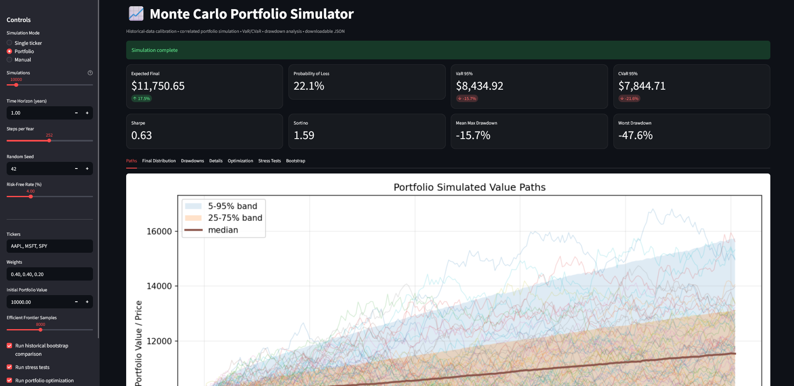
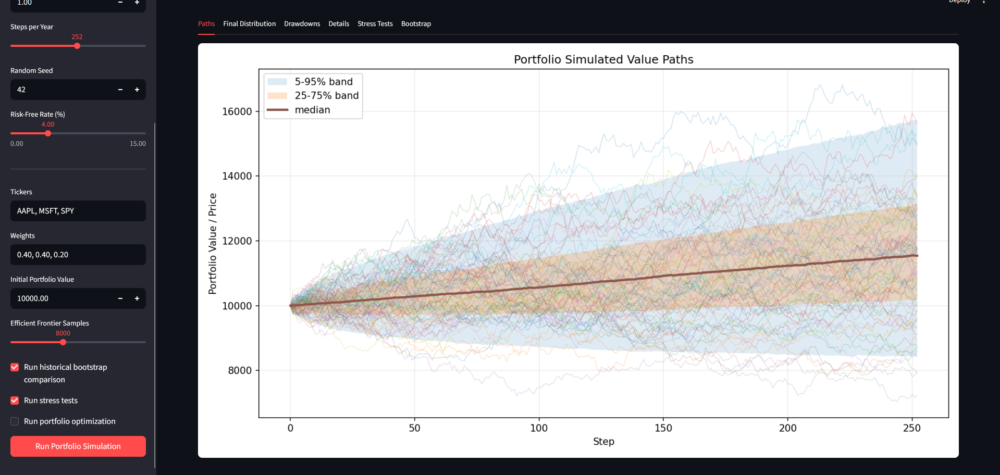
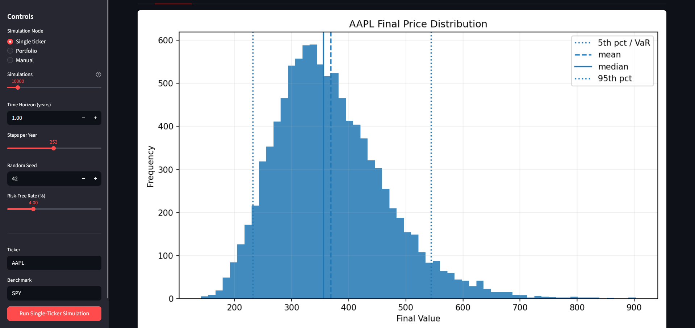
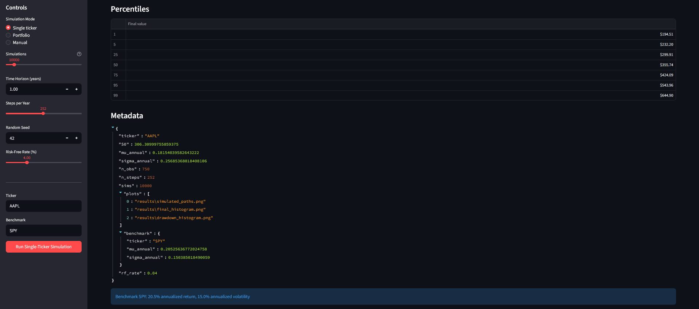

# Monte Carlo Portfolio Simulator

An interactive portfolio risk analytics platform built in Python. The project supports historical market data retrieval, vectorized Monte Carlo simulation, portfolio risk metrics, stress testing, efficient frontier optimization, and a Streamlit dashboard for live experimentation.



## Features

* Vectorized Geometric Brownian Motion simulation
* Multi-asset portfolio simulation with custom weights
* Historical market data retrieval using `yfinance`
* Historical bootstrap simulation using real sampled returns
* Risk metrics including:

  * Expected final value
  * Expected return
  * Volatility
  * Sharpe ratio
  * Sortino ratio
  * Value at Risk
  * Conditional Value at Risk
  * Max drawdown
  * Probability of loss
* Frontier analysis

  * Maximum Sharpe portfolio
  * Minimum volatility portfolio
  * Long-only random portfolio sampling
* Stress testing scenarios

  * Market crash
  * Severe crash
  * Relief rally
  * Base case comparison
* Interactive Streamlit dashboard
* Live parameter controls
* Synchronized charts for paths, distributions, and detailed risk metrics
* HTML report export
* CLI support
* Unit tests for simulator, metrics, optimizer, and stress testing

## Screenshots

### Main Dashboard


### Simulation Paths



### Distribution Analysis



### Risk Details



## Tech Stack

* Python
* NumPy
* pandas
* yfinance
* Matplotlib
* Plotly
* SciPy
* Streamlit
* pytest

## Project Structure

```text
Monte Carlo Sim/
├── assets/
│   ├── dashboard.png
│   ├── details.png
│   ├── distribution.png
│   └── paths.png
├── src/
│   ├── examples/
│   │   └── streamlit_app.py
│   └── mc_portfolio/
│       ├── cli.py
│       ├── data.py
│       ├── metrics.py
│       ├── optimizer.py
│       ├── reporting.py
│       ├── simulator.py
│       └── stress.py
├── tests/
├── requirements.txt
├── pyproject.toml
└── README.md
```

## Installation

Clone the repository:

```bash
git clone https://github.com/YOUR_USERNAME/YOUR_REPOSITORY_NAME.git
cd "Monte Carlo Sim"
```

Create and activate a virtual environment:

```bash
python -m venv venv
```

On Windows:

```bash
venv\Scripts\activate
```

On macOS/Linux:

```bash
source venv/bin/activate
```

Install dependencies:

```bash
pip install -r requirements.txt
pip install -e .
```

## Running the Streamlit Dashboard

From the project root, run:

```bash
python -m streamlit run src/examples/streamlit_app.py
```

Or on Windows:

```bash
py -m streamlit run src/examples/streamlit_app.py
```

## Running the CLI

Example portfolio simulation:

```bash
python -m mc_portfolio.cli --tickers SPY QQQ TLT --weights 0.5 0.3 0.2
```

Windows:

```bash
py -m mc_portfolio.cli --tickers SPY QQQ TLT --weights 0.5 0.3 0.2
```

Example with bootstrap simulation:

```bash
py -m mc_portfolio.cli --tickers SPY QQQ TLT --weights 0.5 0.3 0.2 --bootstrap
```

Example with more Efficient Frontier samples:

```bash
py -m mc_portfolio.cli --tickers SPY QQQ TLT GLD --weights 0.4 0.3 0.2 0.1 --frontier_portfolios 10000
```

## Testing

Run the full test suite:

```bash
python -m pytest
```

Expected result:

```text
6 passed
```

## How It Works

The simulator retrieves historical adjusted closing prices, converts them into daily returns, estimates annualized return and volatility, then simulates future portfolio paths using Monte Carlo methods.

For multi-asset portfolios, the simulator supports weighted portfolio construction and risk aggregation. The dashboard allows users to adjust tickers, weights, time horizon, initial investment, number of simulations, and simulation method.

The project includes both parametric simulation through Geometric Brownian Motion and non-parametric historical bootstrap simulation. This allows users to compare model-based assumptions against simulations generated from actual historical return samples.

## Key Financial Metrics

### Value at Risk

Value at Risk estimates the potential loss at a given confidence level. For example, 95% VaR estimates the loss threshold that only 5% of simulated outcomes exceed.

### Conditional Value at Risk

Conditional Value at Risk measures the average loss in the worst simulated outcomes beyond the VaR threshold. It is useful for understanding tail risk.

### Sharpe Ratio

The Sharpe ratio compares excess return to volatility and is commonly used to evaluate risk-adjusted performance.

### Sortino Ratio

The Sortino ratio is similar to the Sharpe ratio but penalizes only downside volatility.

### Max Drawdown

Max drawdown measures the largest peak-to-trough decline across simulated portfolio paths.

## License

This project is available under the MIT License.
